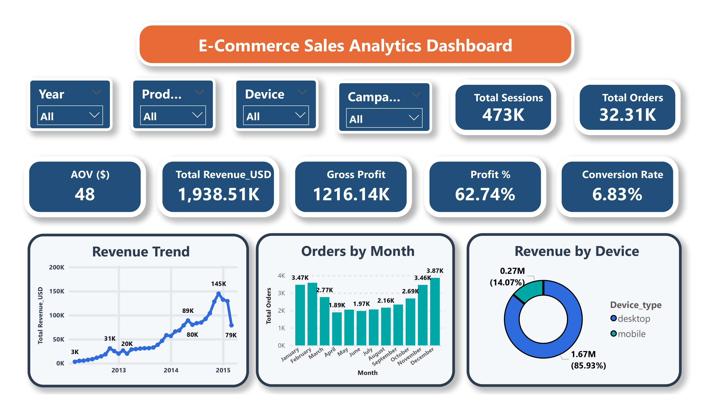
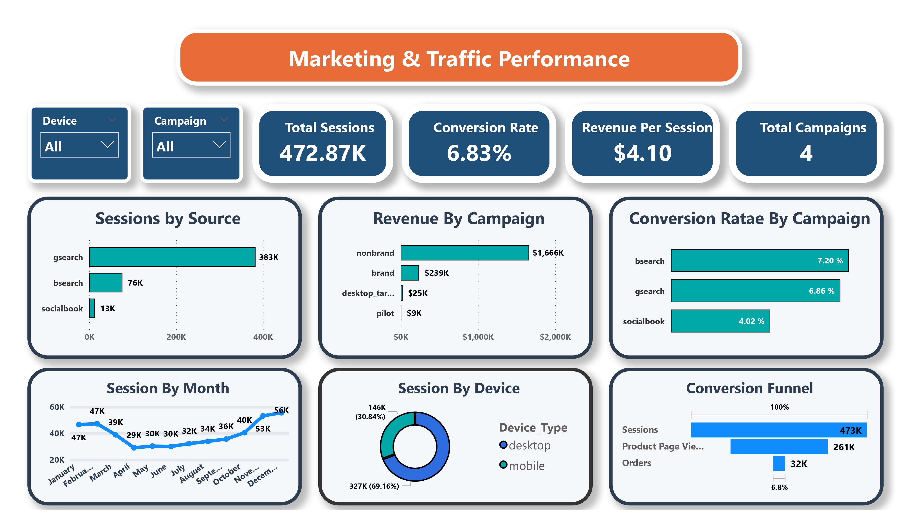
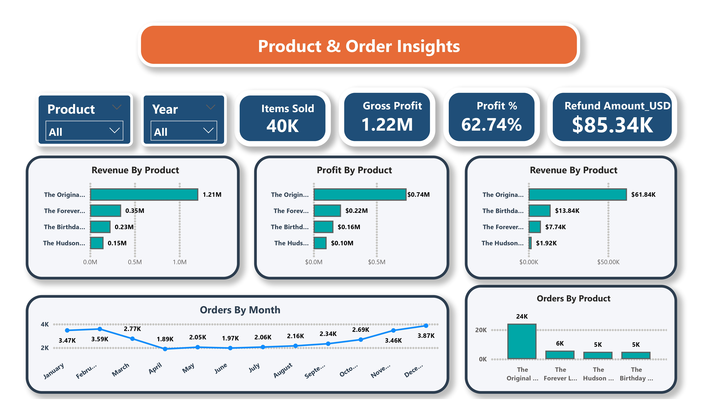

# ecommerce-powerbi-dashboard
"E-Commerce Sales Analytics Dashboard built in Power BI using Maven Analytics fuzzy factory dataset"


# 📊 E-Commerce Sales Analytics Dashboard — Power BI


A full-scale, 4-page interactive business intelligence dashboard built in **Power BI Desktop**, analyzing e-commerce performance across sales, marketing, product, and device behavior dimensions.

> 📦 Dataset: `maven_fuzzy_factory` from [Maven Analytics](https://www.mavenanalytics.io/)

---

## 🖥️ Dashboard Preview

| Page | Preview |
|------|---------|
| 📈 E-Commerce Sales Analytics |  |
| 📣 Marketing & Traffic Performance |  |
| 📦 Product & Order Insights |  |
| 📱 Customer & Device Behavior |  |

---

## 🔑 Key Metrics

| Metric | Value |
|--------|-------|
| 💰 Total Revenue | $1.94M |
| 🛒 Total Orders | 32.31K |
| 📦 Items Sold | 40K |
| 💵 Average Order Value (AOV) | $48 |
| 📈 Gross Profit | $1.22M |
| 📊 Profit Margin | 62.74% |
| 🌐 Total Sessions | 473K |
| 🔄 Conversion Rate | 6.83% |
| 💳 Revenue per Session | $4.10 |
| 🔁 Refund Amount | $85.34K |

---

## 📋 Dashboard Pages

### 1️⃣ E-Commerce Sales Analytics (Overview)
- Total Revenue, Orders, AOV, Gross Profit, Profit %, Conversion Rate KPIs
- Revenue Trend line chart (2013–2015)
- Orders by Month bar chart
- Revenue by Device donut chart
- Slicers: Year, Product, Device, Campaign

### 2️⃣ Marketing & Traffic Performance
- Total Sessions, Conversion Rate, Revenue per Session, Total Campaigns KPIs
- Sessions by Source (gsearch: 383K, bsearch: 76K, socialbook: 13K)
- Revenue by Campaign (nonbrand: $1.67M dominant)
- Conversion Rate by Campaign
- Session by Month trend
- Session by Device split
- Conversion Funnel: Sessions (473K) → Product Page Views (261K) → Orders (32K)

### 3️⃣ Product & Order Insights
- Items Sold, Gross Profit, Profit %, Refund Amount KPIs
- Revenue by Product — The Original leads at $1.21M (62%)
- Profit by Product
- Refund Revenue by Product
- Orders by Month & Orders by Product
- Slicers: Product, Year

### 4️⃣ Customer & Device Behavior
- Desktop Sessions (327K) vs Mobile Sessions (146K)
- Desktop CVR (8.50%) vs Mobile CVR (3.09%)
- Revenue, Orders & Conversion Rate by Device
- Session by Month and Device trend
- Conversion Funnel

---

## 💡 Key Business Insights

- 📱 **Mobile conversion gap**: Desktop converts at 8.50% vs mobile at 3.09% — a **174% gap** representing ~$180K in unrealized annual revenue
- 🔍 **Channel dependency risk**: Non-brand Google Search alone drives **86% of total revenue** ($1.67M)
- 🏆 **Product concentration**: The Original product drives **62% of all orders** (24K out of 32K)
- 📅 **Seasonality**: Peak orders in Aug–Sep (3.87K) — critical for inventory & staffing planning
- 💸 **Refund opportunity**: $85.34K in refunds — The Original accounts for $61.84K, worth investigating for quality/return reasons

---

## 🛠️ Technical Implementation

### Data Modeling
- Built **star schema** relationships across 6 tables
- Established one-to-many relationships between fact and dimension tables

### Tables Used
| Table | Description |
|-------|-------------|
| `orders` | Order-level data with session linkage |
| `order_items` | Line items per order with product & revenue |
| `order_item_refunds` | Refund transactions |
| `products` | Product master data |
| `website_sessions` | Session-level data with UTM & device info |
| `website_pageviews` | Pageview-level data for funnel analysis |

### Power Query Transformations
- Split columns using special character delimiters
- Removed duplicates and handled null values
- Merged queries across tables
- Formatted date, text, and numeric columns
- Renamed and reordered columns for clarity

### DAX Measures Created
```dax
Total Revenue = SUM(order_items[price_usd])
Gross Profit = SUM(order_items[price_usd]) - SUM(order_items[cogs_usd])
Profit % = DIVIDE([Gross Profit], [Total Revenue])
AOV = DIVIDE([Total Revenue], [Total Orders])
Conversion Rate = DIVIDE([Total Orders], [Total Sessions])
Revenue per Session = DIVIDE([Total Revenue], [Total Sessions])
Desktop CVR = CALCULATE([Conversion Rate], website_sessions[device_type] = "desktop")
Mobile CVR = CALCULATE([Conversion Rate], website_sessions[device_type] = "mobile")
Refund Amount = SUM(order_item_refunds[refund_amount_usd])
```

### Visuals Used
- KPI Cards
- Line Charts (Revenue Trend, Session by Month)
- Bar & Horizontal Bar Charts (Orders, Revenue, Sessions by source/campaign)
- Donut Charts (Device split)
- Funnel Chart (Conversion funnel)
- Cross-filtered Slicers (Year, Product, Device, Campaign)

---

## 📁 Repository Structure

```
ecommerce-powerbi-dashboard/
│
├── 📊 ecommerce_dashboard.pbix       # Power BI project file
│
├── 📁 data/                          # Raw dataset (CSV exports)
│   ├── orders.csv
│   ├── order_items.csv
│   ├── order_item_refunds.csv
│   ├── products.csv
│   ├── website_sessions.csv
│   └── website_pageviews.csv
│
├── 📁 screenshots/                   # Dashboard page previews
│   ├── ecom-page-00001.jpg
│   ├── ecom-page-00002.jpg
│   ├── ecom-page-00003.jpg
│   └── ecom-page-00004.jpg
│
└── README.md
```

---

## 🚀 How to Use

1. Clone this repository:
   ```bash
   git clone https://github.com/dakeshav2028/ecommerce-powerbi-dashboard.git
   ```
2. Open `ecommerce_dashboard.pbix` in **Power BI Desktop** (free download from Microsoft)
3. If data doesn't load automatically, go to **Home → Transform Data → Data Source Settings** and re-point to the `/data` folder
4. Explore all 4 dashboard pages using the slicers and filters

---

## 📌 Data Source

- **Dataset**: `maven_fuzzy_factory`
- **Provider**: [Maven Analytics](https://www.mavenanalytics.io/)
- **Domain**: E-Commerce / Retail Analytics

---

## 👤 Author

**KeshavSarda** — Aspiring Data Analyst  
🔗 [GitHub](https://github.com/dakeshav2028) | 🔗 [LinkedIn](https://linkedin.com/in/keshav-sardaofficial)

---

## ⭐ If you found this project helpful, please consider giving it a star!
